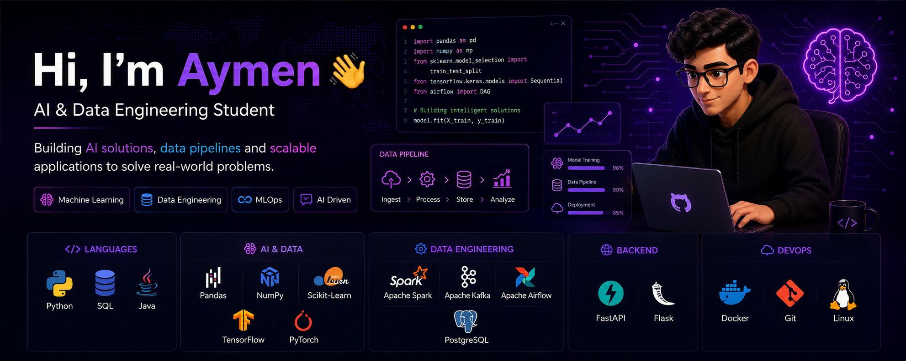

  

<h1 align="center">
Hi, I'm Sellag Aymen 👋
</h1>

<h3 align="center">
🎓 AI & Data Engineering Student
</h3>

Building AI solutions • Data Pipelines • Learning MLOps • Future AI Engineer 🚀

---

# 👨‍💻 About Me

I'm a **4th-year AI & Data Engineering student** passionate about building intelligent systems that solve real-world problems.

I enjoy transforming ideas into practical AI applications while continuously learning modern data technologies.

Currently focusing on:

- 🤖 Artificial Intelligence
- 🧠 Machine Learning
- 📊 Data Engineering
- ⚙️ MLOps
- 💬 LLM Applications
- 🚀 Backend Development

---

# 🌱 Currently Learning

- Apache Spark
- Apache Kafka
- Apache Airflow
- FastAPI
- Docker
- TensorFlow
- PyTorch
- Retrieval-Augmented Generation (RAG)
- MLOps

---

# 🛠 Tech Stack

## 💻 Languages

---

## 🧠 AI & Data

  

  
  
  

---

## 📊 Data Engineering

  

  
  
  

---

## ⚙ Backend

---

## ☁ DevOps

---

# 🎯 Goals for 2026

✅ Build high-quality AI projects

✅ Master Data Engineering fundamentals

✅ Learn Production MLOps

✅ Contribute to Open Source

✅ Secure an AI/Data Engineering Internship

---

# 🚀 Featured Projects

| Project | Description |
|----------|-------------|
| 🤖 AI Internship Hunter Agent | AI agent that finds and matches internship opportunities |
| 💬 RAG Chatbot | Retrieval-Augmented Generation chatbot |
| 📊 Data Pipeline | Airflow + Kafka + Spark pipeline |
| 📄 CV Analyzer | AI-powered resume analysis |
| 🎬 Recommendation System | Machine Learning recommendation engine |

---

# 📫 Connect With Me

📍 Morocco

📧 Email   : aymensellag1007@gmail.com

💼 LinkedIn: https://www.linkedin.com/in/sellag-aymen-9b1a69366/
